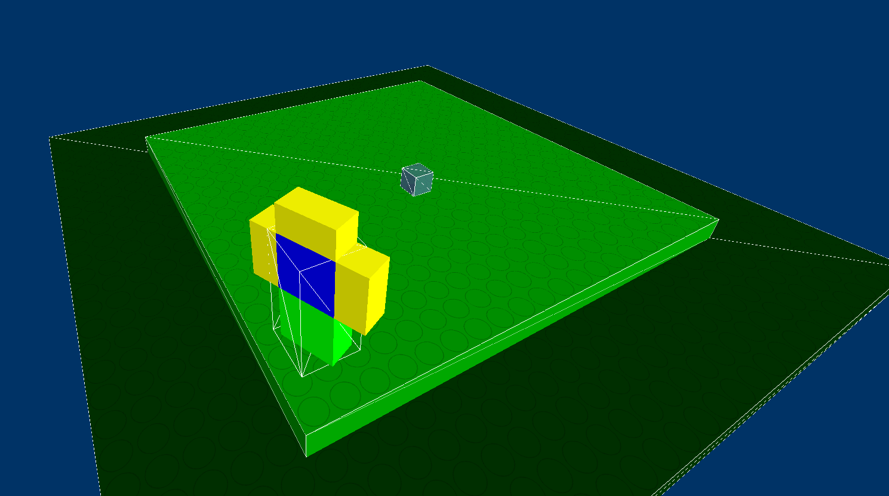

# FreeBuild

A 3D brick building sandbox game.

## Building

This project aims to be self-contained C code. The only third-party dependency is GLFW.

To build the project on Linux/BSD, run the following:

`cc main.c -o bin -lGL -lglfw -lm`

Then simply run the game with `./bin`!

## Controls

The demo scene has the following controls:

Left/right - look left/right

WASD - movement

Ctrl - toggle physics wireframe view

V - toggle noclip mode

R - reset player position to (0,0,0)

Space - jump (noclip disabled) or ascend (noclip enabled)

Shift - descend (noclip enabled)

Left click - select brick (twice to delete)

Right click - place brick

M - enter scale mode

N - enter translate mode

B - enter color mode (press number key row from 1 to 0 to specify R, G, then B)

## Features

✓ Interactive player character & camera

✓ AABB collisions system

✓ Gravity, jumping, stair climbing

✓ Model texturing

✓ Building

_ Entities

_ HUD

_ World saving

_ Multiplayer
